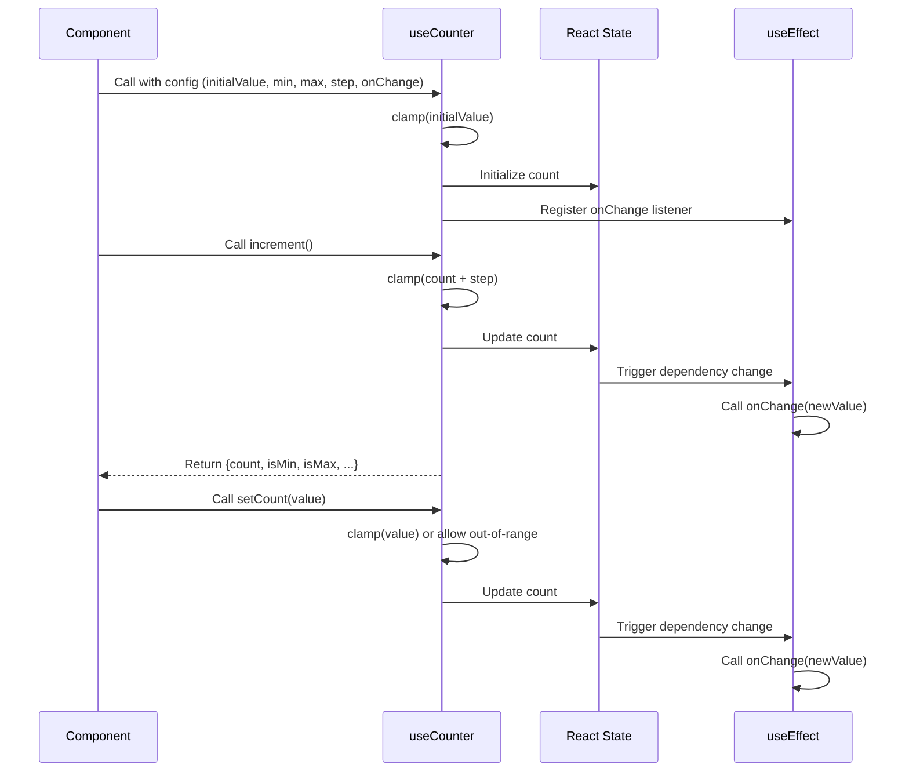

# useCounter

## Sequence Diagram

```mermaid
sequenceDiagram
    participant Component
    participant useCounter
    participant State as React State
    participant Effect as useEffect

    Component->>useCounter: Call with config (initialValue, min, max, step, onChange)
    useCounter->>useCounter: clamp(initialValue)
    useCounter->>State: Initialize count
    useCounter->>Effect: Register onChange listener

    Component->>useCounter: Call increment()
    useCounter->>useCounter: clamp(count + step)
    useCounter->>State: Update count
    State->>Effect: Trigger dependency change
    Effect->>Effect: Call onChange(newValue)
    useCounter-->>Component: Return {count, isMin, isMax, ...}

    Component->>useCounter: Call setCount(value)
    useCounter->>useCounter: clamp(value) or allow out-of-range
    useCounter->>State: Update count
    State->>Effect: Trigger dependency change
    Effect->>Effect: Call onChange(newValue)
```
