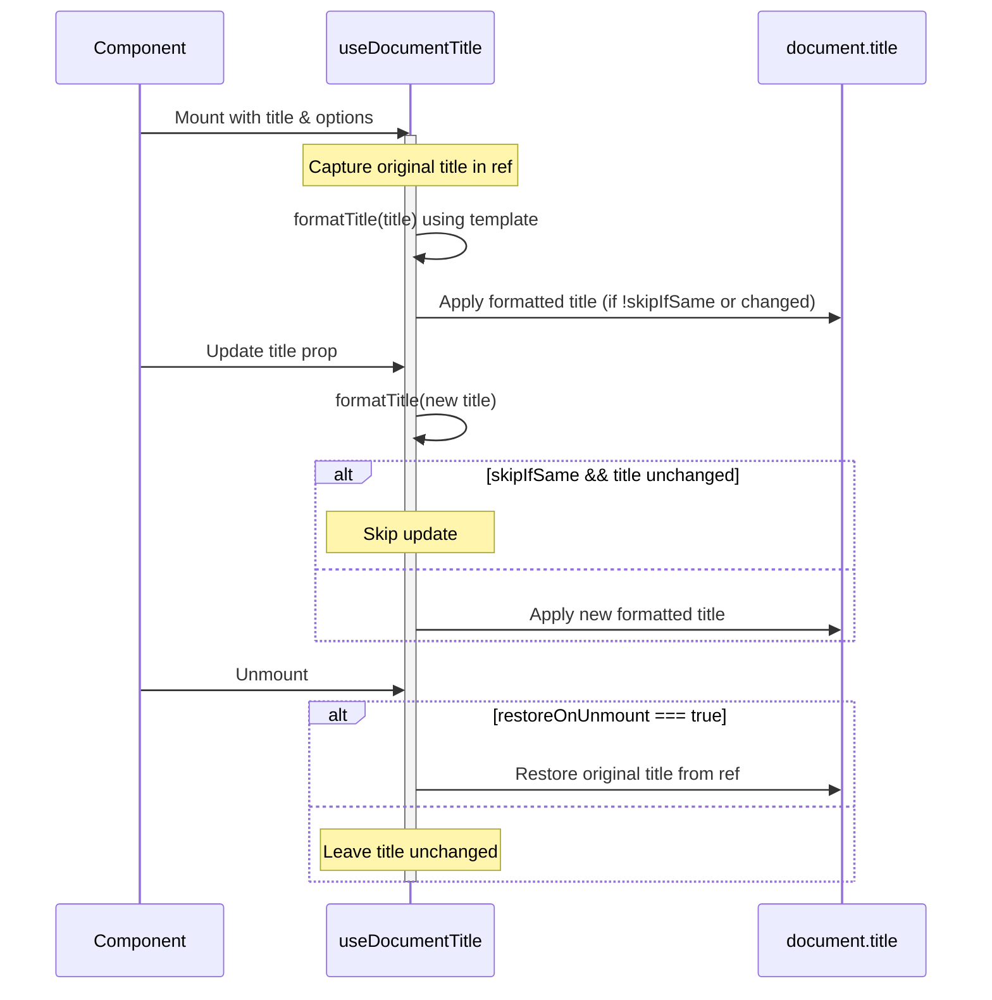

# useDocumentTitle

## Sequence Diagram

```mermaid
sequenceDiagram
    participant Component
    participant useDocumentTitle
    participant Document as document.title

    Component->>useDocumentTitle: Mount with title & options
    activate useDocumentTitle

    Note over useDocumentTitle: Capture original title in ref
    useDocumentTitle->>useDocumentTitle: formatTitle(title) using template
    useDocumentTitle->>Document: Apply formatted title (if !skipIfSame or changed)

    Component->>useDocumentTitle: Update title prop
    useDocumentTitle->>useDocumentTitle: formatTitle(new title)
    alt skipIfSame && title unchanged
        Note over useDocumentTitle: Skip update
    else
        useDocumentTitle->>Document: Apply new formatted title
    end

    Component->>useDocumentTitle: Unmount
    alt restoreOnUnmount === true
        useDocumentTitle->>Document: Restore original title from ref
    else
        Note over useDocumentTitle: Leave title unchanged
    end

    deactivate useDocumentTitle
```
